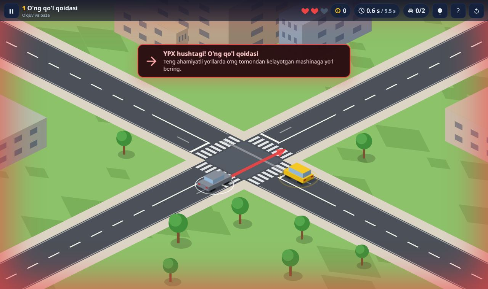
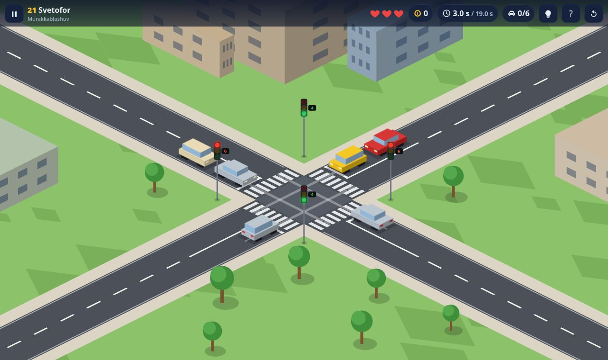
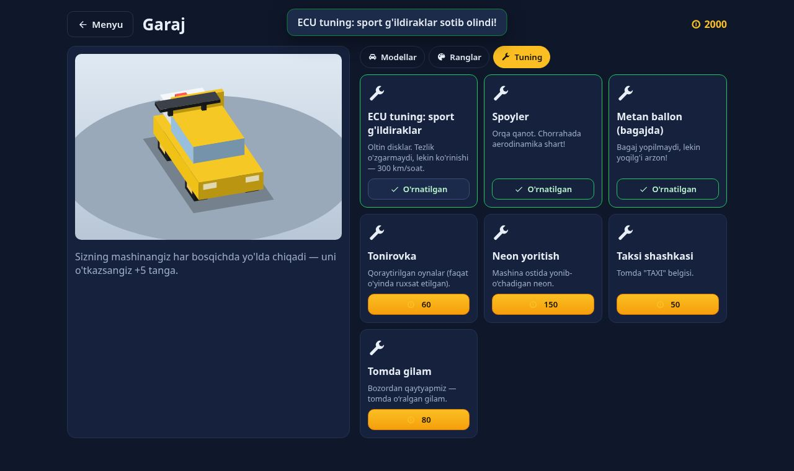

# 🚦 Chorraha Boshqaruvi — Traffic Puzzle

Yo'l harakati qoidalariga asoslangan **2D izometrik boshqotirma o'yin**. Siz — chorrahaning "ko'rinmas tartibga soluvchisi"siz: har yo'nalishda mashinalar navbatda turadi, qaysi birini bossangiz — o'sha yuradi. Qoidani buzsangiz: **YPX hushtagi**, mashinalar **qizil miltillaydi**, **jon** kamayadi.


| Jarima (o'ng qo'l qoidasi) | Boss: regulirovshik | Aylanma harakat |
|---|---|---|
|  |  |  |
| **Svetofor (sanagich bilan)** | **Garaj va tuning** | **Final boss — 30 ta mashina** |
|  |  |  |

## O'ynash

```bash
cd traffic-puzzle
npm run serve        # http://localhost:8080 (dist/ repoda tayyor, build shart emas)
```

Yoki `traffic-puzzle/` papkasini istalgan statik hostingga qo'ying. GitHub Pages uchun: *Settings → Pages → Deploy from branch → main / root* → `https://<user>.github.io/3-amaliyot/traffic-puzzle/`.

**Boshqaruv:** mashinani bosing · `P`/`Space` — pauza · `R` — qayta · `H` — maslahat.

## Nimalar bor

- **Qoidalar yadrosi** — o'ng qo'l qoidasi, chapga burilishda qarshidagiga yo'l berish, asosiy yo'l ◆ / yo'l bering ▽ / STOP, svetofor (yashil-miltillovchi, sariq, qizil+sariq, sariq-miltillovchi), **maxsus transport** ustunligi, **aylanma** (halqadagilar ustun), **regulirovshikning haqiqiy ishoralari** (qo'llar yonga, o'ng qo'l oldinga, qo'l tepaga), **tiqilinch** (4 tomon bir-birini kutsa — Tarjan SCC bilan aniqlanadi).
- **Fizik to'g'rilik** — mashina faqat traektoriyasi haqiqatan kesishadigan mashinaga yo'l beradi; chorrahadagi mashina bilan zonani bir vaqtda egallash = to'qnashuv (fazo-vaqt tekshiruvi).
- **Navbat** — 2-mashinani bosish hech narsa qilmaydi; oldingisi ketgach keyingilar silliq siljiydi; keyinroq keladigan mashinalar (tirbandlik).
- **50 bosqich**: 1–10 X-chorrahalar (o'ng qo'l), 11–30 belgilar va svetoforlar, 31–50 aylanma va "trassalar", har 10-bosqich **BOSS** (regulirovshik). Hammasi avtopilot tomonidan jazosiz yechilishi isbotlangan.
- **Iqtisod va garaj** — tangalar, 3 yulduz (o'tdi / xatosiz / tez), Matiz, Damas, Nexia 3, Spark, **Cobalt**, Gentra, Tracker, Malibu; ranglar; tuning: ECU sport g'ildiraklar, spoyler, **metan ballon (bagajda)**, tonirovka, neon, taksi shashkasi, tomda gilam. Sizning mashinangiz har bosqichda yo'lda chiqadi.
- **Level muharriri** — forma orqali chorraha yig'ish, validator + avtopilot tekshiruvi, sinab ko'rish, JSON eksport/import.
- **Supabase** — bulutli saqlash; natija "replay" sifatida yuboriladi va serverda **o'sha yadro bilan qayta simulyatsiya** qilinadi (anti-cheat). RLS, atomik xaridlar.
- **Performance** — 20+ mashina 60 fps; statik sahna keshi, sprayt LRU kesh, painter's algorithm, interpolatsiya. Sozlamalarda FPS paneli.
- **Nol runtime dependency** — toza TypeScript, framework'siz.

## Loyiha tuzilmasi

| Papka | Vazifa |
|---|---|
| `src/core/` | Toza o'yin yadrosi: geometriya, qoidalar (`canVehicleMove`), engine, replay, bot |
| `src/content/` | 50 bosqich (qo'lda + generator), garaj katalogi, o'zbekcha qoida matnlari |
| `src/web/` | Brauzer mijozi: izometrik renderer, ekranlar, audio, saqlash, Supabase mijozi |
| `supabase/` | SQL migratsiya (jadvallar, RLS, RPC) va `submit-run` edge function |
| `levels/` | `campaign.json` (eksport) va `level.schema.json` |
| `tests/` | 63 ta test |
| `docs/` | Qo'llanmalar va skrinshotlar |

## Buyruqlar

```bash
npm install          # faqat TypeScript (dev)
npm run build        # src → dist
npm test             # build + 63 test (geometriya, har bir qoida, engine, 50 bosqich, web, edge)
npm run campaign     # 50 bosqichni qayta generatsiya qilib muzlatish
npm run build:edge   # Supabase edge function uchun yadroni ko'chirish
npm run e2e          # brauzerda uchdan-uchgacha tekshiruv (playwright-core kerak)
npm run perf         # 24 mashinali stress-test
```

## Hujjatlar

- [ARCHITECTURE.md](ARCHITECTURE.md) — state management, validatsiya algoritmi, level strukturasi, performance, anti-cheat (EN)
- [docs/RULES.md](docs/RULES.md) — o'yindagi yo'l harakati qoidalari va ularning ustuvorligi
- [docs/LEVEL_DESIGN.md](docs/LEVEL_DESIGN.md) — bosqich yaratish (JSON format, muharrir, generator)
- [docs/SUPABASE.md](docs/SUPABASE.md) — bulutli saqlashni ulash
- [docs/REACT_NATIVE.md](docs/REACT_NATIVE.md) — React Native / Flutter'ga ko'chirish (EN)
- [docs/MASTER_PROMPT.md](docs/MASTER_PROMPT.md) — loyiha spetsifikatsiyasi va bajarilish holati

> O'yindagi qoidalar — o'quv maqsadidagi soddalashtirilgan model (har yo'nalishda bitta bo'lak, piyodalar yo'q). Rasmiy YHQ matni o'rnini bosmaydi.
