# Chorraha Boshqaruvi — Traffic Puzzle

Yo'l harakati qoidalariga asoslangan **2D izometrik boshqotirma o'yin**. Siz — chorrahaning "ko'rinmas tartibga soluvchisi"siz: har yo'nalishda mashinalar navbatda turadi, qaysi birini bossangiz — o'sha yuradi. Qoidani buzsangiz: **YPX hushtagi**, mashinalar **qizil miltillaydi**, **jon** kamayadi.

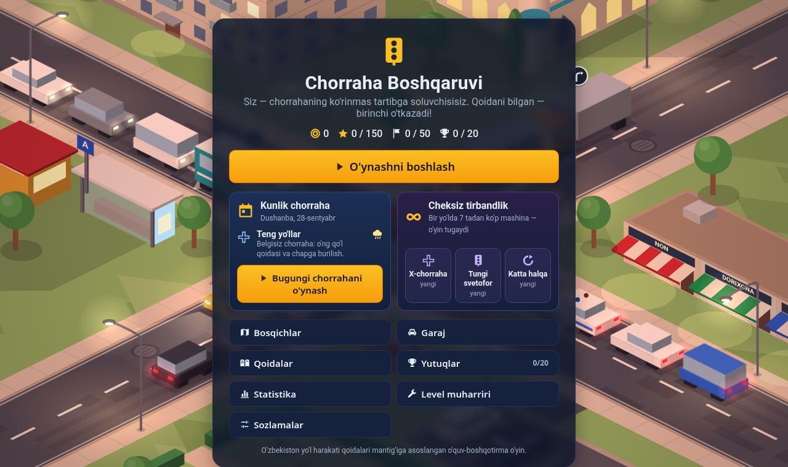

| "Nega?" izohi (sichqoncha ustida) | Tun: faralar, fonarlar, derazalar | Yomg'ir |
|---|---|---|
| 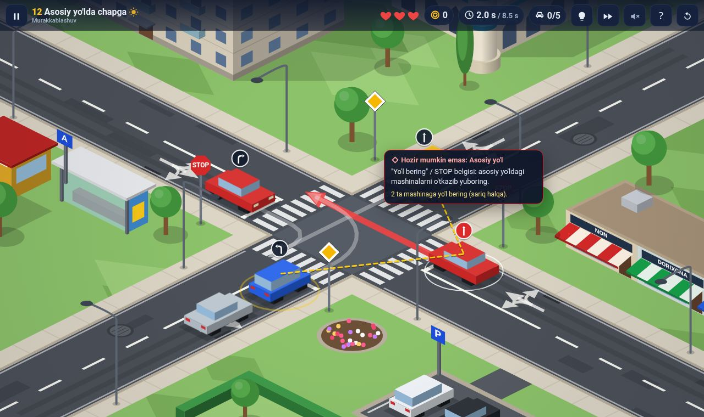 | 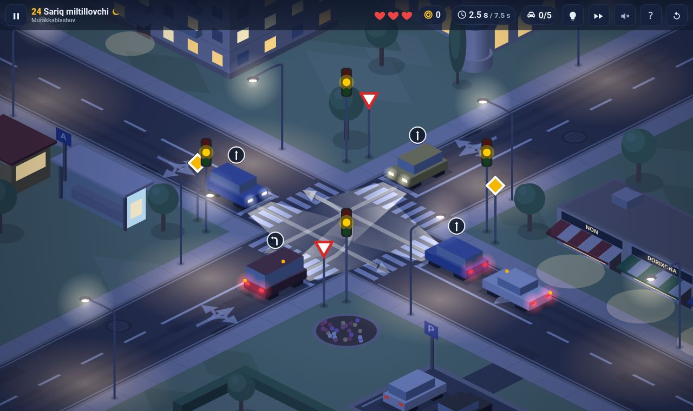 | 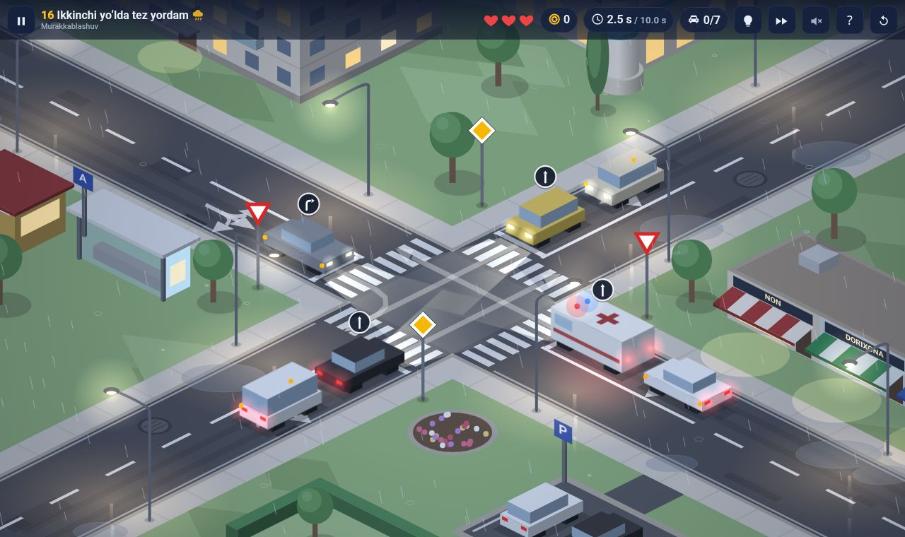 |
| **Boss: regulirovshik (kechqurun)** | **Aylanma harakat** | **Natija: yulduzlar, yutuqlar, konfetti** |
| 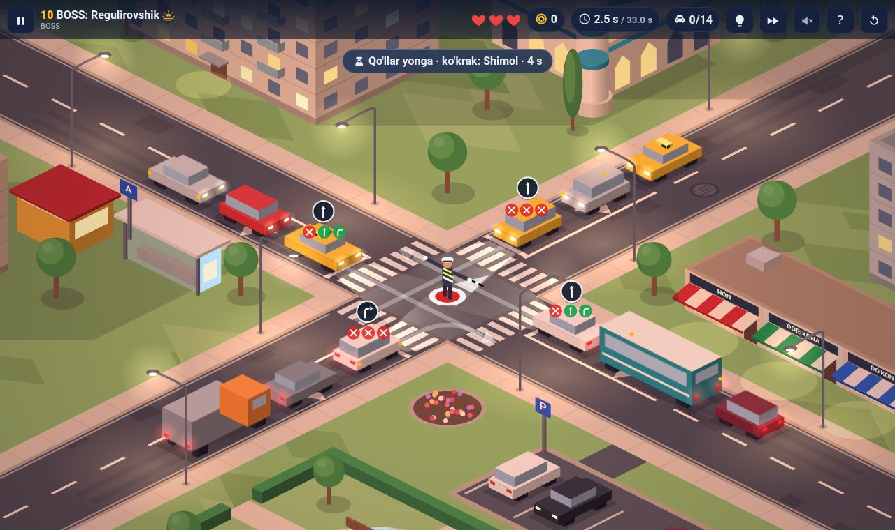 | 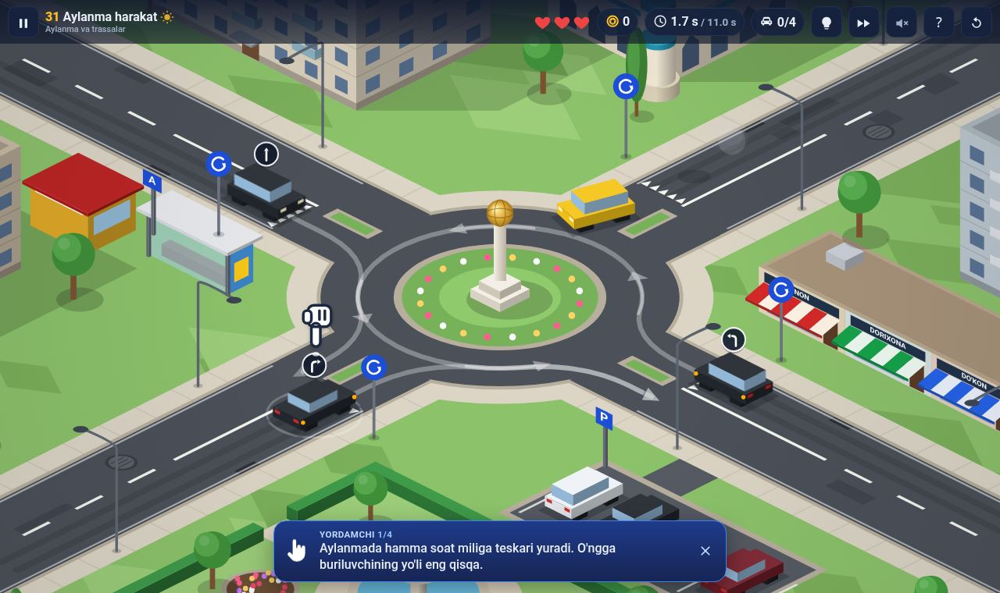 | 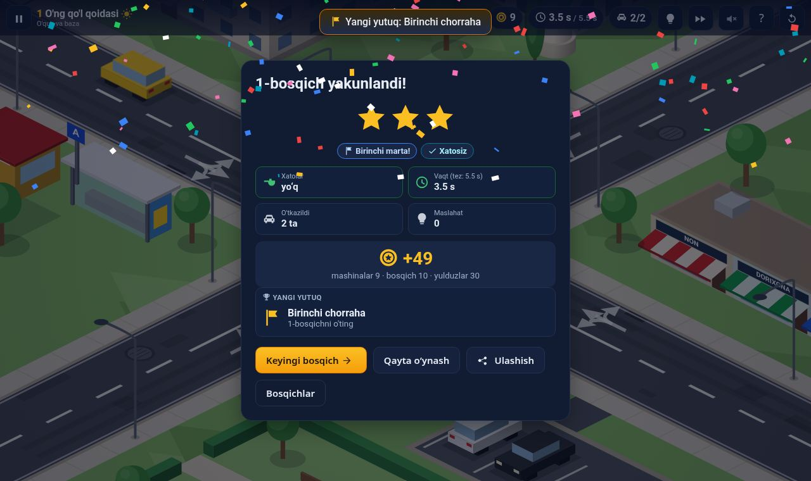 |
| **Final boss — 30 mashina, tunda < 1 ms/kadr** | **Level muharriri + jonli ko'rinish** | **Statistika: qaysi qoidada xato** |
| 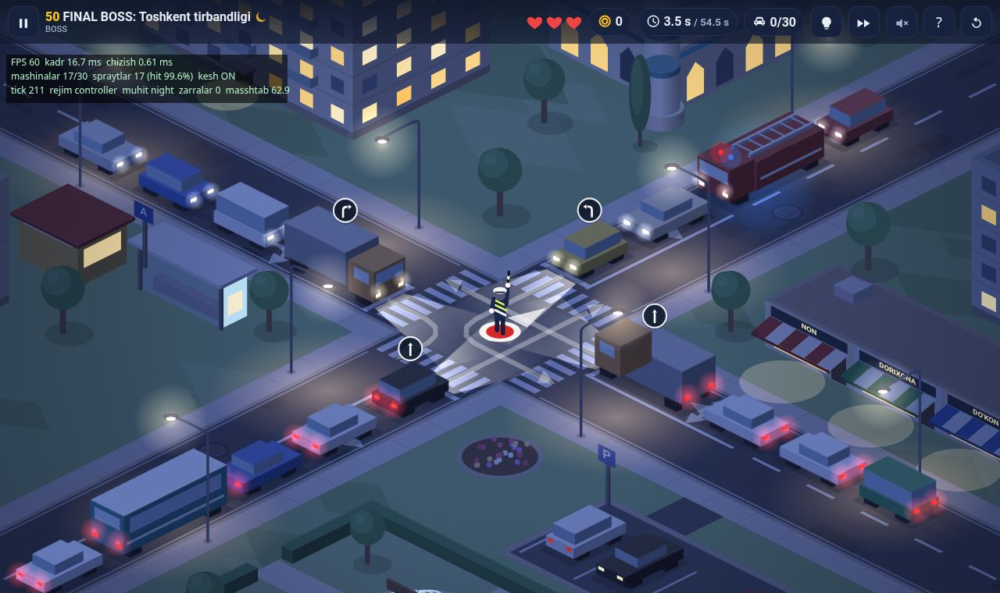 | 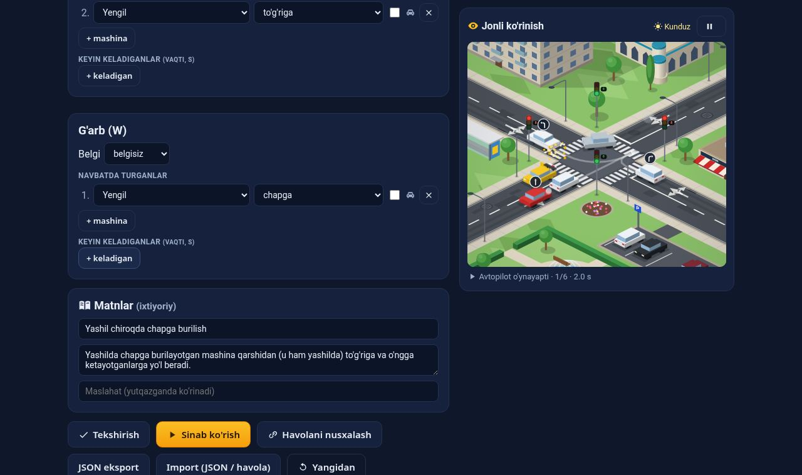 | 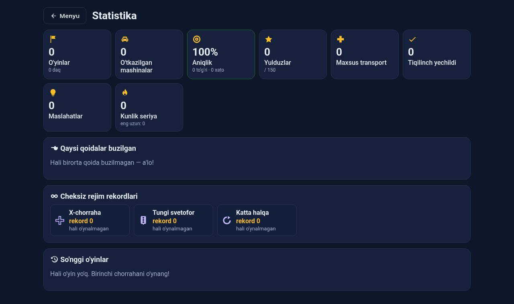 |

| Telefon: menyu | Telefon: o'yin | Telefon: cheksiz rejim |
|---|---|---|
| 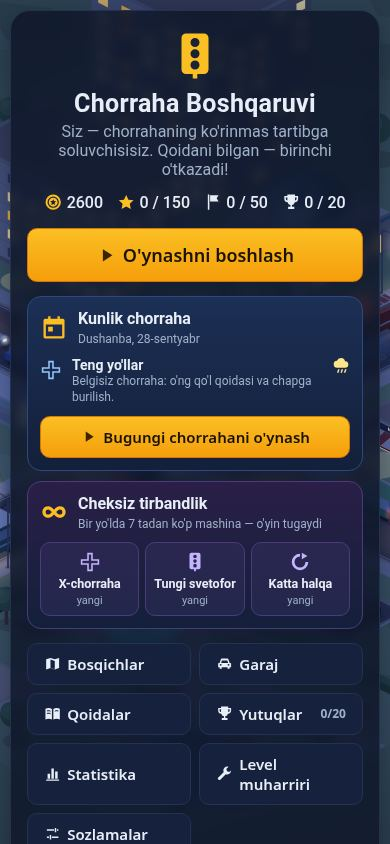 | 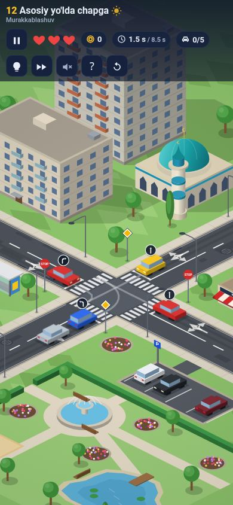 | 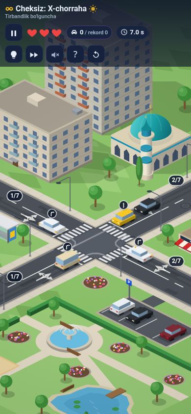 |

## O'ynash

```bash
cd traffic-puzzle
npm run serve        # http://localhost:8080 (dist/ repoda tayyor, build shart emas)
```

Yoki `traffic-puzzle/` papkasini istalgan statik hostingga qo'ying. GitHub Pages uchun: *Settings → Pages → Deploy from branch → main / root* → `https://<user>.github.io/3-amaliyot/traffic-puzzle/`. HTTPS yoki localhost'da o'yin **ilova sifatida o'rnatiladi** (menyuda "O'rnatish") va **internetsiz ham ishlaydi**.

**Boshqaruv:** mashinani bosing (telefonda uzoq bosish — "Nega?" izohi) · `1`–`4` — Shimol/Sharq/Janub/G'arb mashinasi · `H` — maslahat · `F` — 2× tezlik · `M` — ovoz · `R` — qayta · `P`/`Esc` — pauza.

## Nimalar bor

- **Qoidalar yadrosi** — o'ng qo'l qoidasi, chapga burilishda qarshidagiga yo'l berish, asosiy yo'l / yo'l bering / STOP, svetofor (yashil-miltillovchi, sariq, qizil+sariq, sariq-miltillovchi), **maxsus transport** ustunligi, **aylanma** (halqadagilar ustun), **regulirovshikning haqiqiy ishoralari**, **tiqilinch** (4 tomon bir-birini kutsa — Tarjan SCC bilan aniqlanadi). Mashina faqat traektoriyasi haqiqatan kesishadigan mashinaga yo'l beradi (fazo-vaqt tekshiruvi).
- **O'rgatuvchi yordam** — 1, 2, 3, 5, 11, 21, 31-bosqichlarda **yordamchi qo'l** qaysi mashinani bosishni ko'rsatadi; **"Nega?"** izohi qoida nomi va kimga yo'l berish kerakligini chiziq bilan ko'rsatadi; mashinalar tepasida **yo'nalish belgisi**; uzoq kutgan mashina "…" deydi, keyin signal chaladi.
- **50 bosqich**: 1–10 X-chorrahalar, 11–30 belgilar va svetoforlar, 31–50 aylanma va "trassalar", har 10-bosqich **BOSS** (regulirovshik). Hammasi avtopilot tomonidan jazosiz yechilishi isbotlangan.
- **Kunlik chorraha** — har kuni yangi, sanadan deterministik yaratiladi, haftaning har kuni o'z mavzusi; **ketma-ketlik (streak)**. **Cheksiz tirbandlik** — 3 variant (X-chorraha, tungi svetofor, katta halqa): bir yo'lda 7 tadan ko'p mashina to'plansa — o'yin tugaydi; rekordlar.
- **Atmosfera** — kunduz, kechqurun, tun, yomg'ir: faralar, stop-chiroqlar, fonar yorug'i, yonib turgan derazalar, ho'l asfalt, tomchilar. Shahar: panel uylar, minorali masjid, "NON / DORIXONA / DO'KON", kiosk, bekat, bog' (favvora, hovuz, o'yin maydonchasi), avtoturargoh.
- **20 ta yutuq** — mukofoti tanga emas, **eksklyuziv kosmetika**: oltin rang, tungi ko'k, O'zbekiston bayroqchasi, tomda qovunlar.
- **Statistika** — aniqlik %, qaysi qoidada necha marta xato, **zaif joy** va shu qoidani o'rgatuvchi bosqichga "Mashq qilish", oxirgi 30 o'yin.
- **Iqtisod va garaj** — tangalar, 3 yulduz (o'tdi / xatosiz / tez); Matiz, Damas, Nexia 3, Spark, **Cobalt**, Gentra, Tracker, Malibu; ranglar; tuning: ECU sport g'ildiraklar, spoyler, **metan ballon (bagajda)**, tonirovka, neon, taksi shashkasi, tomda gilam.
- **Level muharriri** — navbatlar va **keyin keladigan** mashinalar, belgilar, **svetofor vaqtlari**, o'zingiz yozgan **regulirovshik ishoralari**, atmosfera; o'ngda **avtopilot jonli o'ynab ko'rsatadi**; validator + avtopilot tekshiruvi; **havola orqali ulashish** (do'stingiz havolani ochib o'ynaydi); kampaniya bosqichidan namuna olish.
- **Supabase** — bulutli saqlash; natija "replay" sifatida yuboriladi va serverda **o'sha yadro bilan qayta simulyatsiya** qilinadi (anti-cheat), kunlik bosqichni server o'zi qayta yaratadi; **reyting** (TOP-5 + o'z o'rningiz), ism.
- **Performance** — 24 mashina tunda yomg'irda ham 60 fps, render < 1 ms/kadr; statik sahna keshi, rangni chizishda "baholash" (grade), sprayt LRU kesh, yorug'lik spraytlari.
- **Nol runtime dependency** — toza TypeScript, framework'siz. Shrift (Roboto) ilova ichida.

## Loyiha tuzilmasi

| Papka | Vazifa |
|---|---|
| `src/core/` | Toza o'yin yadrosi: geometriya, qoidalar (`canVehicleMove`), engine, replay, bot |
| `src/content/` | 50 bosqich, generator, kunlik/cheksiz rejimlar, yutuqlar, garaj katalogi, o'zbekcha qoida matnlari |
| `src/web/` | Brauzer mijozi: izometrik renderer (shahar, atmosfera, effektlar), ekranlar, muharrir modeli, marshrutlash, PWA, Supabase mijozi |
| `supabase/` | SQL migratsiyalar (jadvallar, RLS, RPC, reyting) va `submit-run` edge function |
| `assets/` | Shriftlar va ilova ikonkalari (`icon.svg` → PNG) |
| `levels/` | `campaign.json` (eksport) va `level.schema.json` |
| `tests/` | 100 ta test |
| `docs/` | Qo'llanmalar va skrinshotlar |

## Buyruqlar

```bash
npm install          # faqat TypeScript (dev)
npm run build        # src → dist + sw.js (offlayn service worker)
npm test             # build + 100 test (qoidalar, 50 bosqich, rejimlar, render geometriyasi, muharrir, web, edge)
npm run campaign     # 50 bosqichni qayta generatsiya qilib muzlatish
npm run build:edge   # Supabase edge function uchun yadroni ko'chirish
npm run e2e          # brauzerda uchdan-uchgacha tekshiruv, 22 ta (playwright-core kerak)
npm run perf         # 24 mashinali stress-test (kunduz / tun / yomg'ir)
npm run icons        # assets/icons/icon.svg → PNG ikonkalar
```

## Hujjatlar

- [ARCHITECTURE.md](ARCHITECTURE.md) — state management, validatsiya algoritmi, level strukturasi, performance, anti-cheat, v3 qo'shimchalari (EN)
- [docs/RULES.md](docs/RULES.md) — o'yindagi yo'l harakati qoidalari, ustuvorlik va o'rgatuvchi yordam
- [docs/LEVEL_DESIGN.md](docs/LEVEL_DESIGN.md) — bosqich yaratish (JSON format, muharrir, havola, generator)
- [docs/SUPABASE.md](docs/SUPABASE.md) — bulutli saqlash, kunlik bosqichlar va reytingni ulash
- [docs/REACT_NATIVE.md](docs/REACT_NATIVE.md) — React Native / Flutter'ga ko'chirish (EN)
- [docs/MASTER_PROMPT.md](docs/MASTER_PROMPT.md) — loyiha spetsifikatsiyasi, v3 rejasi va bajarilish holati

> O'yindagi qoidalar — o'quv maqsadidagi soddalashtirilgan model (har yo'nalishda bitta bo'lak, piyodalar yo'q). Rasmiy YHQ matni o'rnini bosmaydi. Supabase qismi mock testlar bilan tekshirilgan, jonli loyihada hali ishga tushirilmagan.
